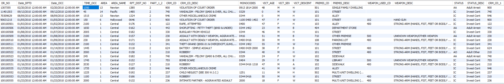

<h1 align="center">Los Angeles Crime Analysis</h1>

  

  
  
  
  
  
  
  

  

    Badge <a href="https://shields.io/">Source</a>
  

  <h2>Authors</h2>
  <ul>
    <li><a href="https://github.com/luisosorio3214">@luisosorio3214</a></li>
  </ul>

  <h2>Table of Contents</h2>
  <ul>
    <li><a href="#context" target="_parent">Context</a></li>
    <li><a href="#business-problem" target="_parent">Business Problem</a></li>
    <li><a href="#data-source">Data Source</a></li>
    <li><a href="#info">Data Information</a></li>
    <li><a href="#methods">Methods</a></li>
    <li><a href="#tech-stack">Tech Stack</a></li>
    <li><a href="#quick-glance">Quick glance at the Process</a></li>
    <li><a href="#lesson-learned">Lessons learned and Recommendation</a></li>
    <li><a href="#limitation">Limitation and what can be Improved</a></li>
    <li><a href="#flask">Creating a Flask App</a></li>
    <li><a href="#notebook">Explore the notebook</a></li>
    <li><a href="#render">Deployment on Render</a></li>
    <li><a href="#deployed">App deployed on Render</a></li>
    <li><a href="#contribution">Contribution</a></li>
    <li><a href="#license">License</a></li>
  </ul>

  <section id="Context">
    <h2>Context</h2>
    

      I currently reside in the city of Los Angeles and in the past couple of years, I have seen the issue of homelessness increase. Along side of this, I have seen crime across the entire city increase at least from my perspective. Which is why, I wanted to put my data analysis skills to the test and investigate this further. Living in Los Angeles provides me more insights than just looking at numbers but also the reality of situations, which is why I wanted to do this project. 
    

  </section>

  <section id="business-problem">
    <h2>Business Problem/Context</h2>
    

      After the pandemic, several businesses were forced to shutdown and made everyday life even more difficult. I was given the task to analyze Los Angeles crime data and provide insights using visualizations that displayed key metrics. My goal is to provide crime analysis of Los Angeles for residents, tourists, politicians, and readers to gain further insights and perhaps learn some crime statistics. 
    

  </section>

  <section id="data-source">
    <h2>Data Source</h2>
    Downloaded from Los Angeles Open Data website at <a href="https://data.lacity.org/">data.lacity.org</a>.
    <ul>
      <li><a href="https://data.lacity.org/Public-Safety/Crime-Data-from-2010-to-2019/63jg-8b9z">Crime Data from 2010 to 2019</a></li>
      <li><a href="https://data.lacity.org/Public-Safety/Crime-Data-from-2020-to-Present/2nrs-mtv8">Crime Data from 2020 to Present</a></li>
    </ul>
  </section>

  <section id="info">
    <h2>Data Information</h2>
    

      The crime data from 2010 to 2019 contained a total of 2,135,664 rows of data, where each row corresponds to a particular crime. The crime data from 2020 to Present came with 757,141 total observations and contains crime all the way to July 10, 2023. Both data sets were the same when it came with the column information with a total of 28 attributes. 
    

    
    

      Now some of the column information was encoded to represent a particular crime, status, mono code, ethnicity and more. Also to understand how certain crimes are characterized an entire document was written and upload onto the website described on the data source. Here is a list of some of the documentations and links redirecting to a directory of this repository so you won't need to download them:
      <ul>
        <li><a href="https://github.com/luisosorio3214/Los-Angeles-Crime-Analysis/blob/main/Documentations-pdfs/ucr_handbook_2013.pdf">Crime Characterization Manual</a></li>
        <li><a href="https://github.com/luisosorio3214/Los-Angeles-Crime-Analysis/blob/main/Documentations-pdfs/UCR-COMPSTAT062618.pdf">Crime Code Categories</a></li>
        <li><a href="https://github.com/luisosorio3214/Los-Angeles-Crime-Analysis/blob/main/Documentations-pdfs/MO_CODES_Numerical_20191119.pdf">All Crime Codes</a></li>
      </ul>
    

  </section>

  <section id="methods">
    <h2>Methods</h2>
    <ul>
      <li>Cloud Database</li>
      <li>Exploratory Data Analysis</li>
      <li>Data Cleaning</li>
      <li>Visualizations</li>
      <li>Web App Deployment</li>
    </ul>
  </section>

  <section id="tech-stack">
    <h2>Tech Stack</h2>
    <ul>
      <li>Planet Scale - Cloud Database (AWS Service)</li>
      <li>MYSQL (data cleaning)</li>
      <li>Python (database connection)</li>
      <li>Power B.I. (Reporting tool)</li>
      <li>HTML (Web App)</li>
      <li>Flask (backend)</li>
      <li>Render (Website Deployment to the Cloud)</li>
    </ul>
  </section>

  <section id="quick-glance">
    <h2>Quick Glance at the Process</h2>
    

      Create our <a href="https://planetscale.com/">Planet Scale</a> - Cloud Database
      

        
      

    
  
    

      Creating Table Schemas on MySQL
      

        
      

    

    

      One SQL Query for Data Cleaning
      

        
      

    

    

      Data Exploration using SQL
      

        
      

      

        
      

    

    

      <ul>
        <li>Visualizations Tools: Python and Power BI </li>
        <li>Reporting Tool: HTML & CSS</li>
        <li>After Performing Data Cleansing using SQL: I used a python library called SQLAlchemy to connect to my database engine so I can create visualizations. I leveraged well-known libraries such as Matplotlib and Seaborn to pull specific data from my database engine and create my engine. Now I did now want to pull the full 3 million rows of data onto my python script, so used the queries I created to generate the specific data. After I created my visualizations, I saved the images to a directory so I can build my report. Now during my data exploratory, I saw that each crime was allocated a latitude and longitude coordinates and recognized I use to to create a power report on Power Bi using the geo-map visualizations. I created a geo-map visualizations where I further used other tools such as slicers so the end-user can filter the data to see specific crime locations and time frames. The organize all my work, I decided to display my report onto a web page so I used HTML & CSS to create the page.</li>
      </ul>
      

        Here is a quick peak of the resulting Dashboard that I created:
        
      

    

  </section>

  <section id="lesson-learned">
  <h2>Lessons Learned and Recommendation</h2>
  

    <ul>
      <li>The main take away I learned through this project was how to connect to my database using python. This will give me a huge advantage since I consider myself a python programmer, I'm quite familiar with various python packages. For example, I often use pandas and numpy for my data analysis, however, I was always connecting to various tables through other data sources such as cvs, json, links, excel, and pdfs to put them into data frames. However, now I Can use SQL to query specific data and put them into a data frame So I can work with easily. I also learned the security aspect of connecting to my database since I frequently, upload my work onto GitHub a free open source, I didn't want anyone to login onto my database. To fix this issue, I created an environment variable to store sensitive information and keep them secret so nobody would wipe out my data on my database.</li> 
      <li>Also I learned how to deploy web applications using Flask, a micro web framework written in python. Using my written HTML code, I was easily able to create a flask app to deploy my code onto the web, however, another issue arose since the server was only available locally which is only used for testing purposes. I had to find a way to deploy the web application onto the cloud so the serve will stay up even after I close my code editor. Thats when I used Render to deploy my application onto the web.</li>   
    </ul>
  

  <section id="limitation">
    <h2>Limitation and what can be Improved</h2>
    

      <ul>
        <li>Some of the limitations about my project was the Planet Scale database I created since I was using the free tier, i was given many constraints such as row reads, row writes, and storage. I could create 10 million row writes, in other words upload 10 million rows of data onto cloud database. I also was only allowed 5gb of storage, luckily by data fell short to 101 gbs used. Plus I was only allowed 1 billion row reads, meaning the amount of data I can query. This allowed me to strategically formulate my SQL queries and think about what data I wanted to pull. Now you can easily upgrade your membership and plan out your specific storage and row write/read for your specific needs.</li>
      </ul>
    

  </section>

  <section id="flask">
    <h2>Creating a Flask App</h2>
    

      First Create a Project directory 
    
    
      <h4>Import flask library</h4>
        <pre>
          <code style="height: 50%;">
          from flask import Flask
          </code>
        </pre>
      <h4>create an app class object</h4>
        <pre>
          <code style="height: 50%;">
          app = Flask(__name__)
          </code>
        </pre>
      <h4>Use route decorator to tell Flask what URL to trigger </h4>
        <pre>
          <code style="height: 50%;">
          app = Flask(__name__)
          @app.route("/")
          def hello_world():
              return "HTML code Here"
          </code>
        </pre>
      
Just like that you have created your first flask application. Of course to create a more complicate application you would return an HTML template with your function under your route. I highly recommend you view the Flask documentation <a href="https://en.wikipedia.org/wiki/Flask_(web_framework)">here</a>

    

    Check out my flask application <a href="https://github.com/luisosorio3214/Los-Angeles-Crime-Analysis/blob/main/app.py">here</a>. 
    

  </section>

  <section id="notebook">
  <h2>Explore the Visualizations Notebook</h2>
  

    To explore the notebook click <a href="https://github.com/luisosorio3214/Los-Angeles-Crime-Analysis/blob/main/crime_visuals.ipynb">here</a>.
  

  </section>

  <section id="render">
  <h2>Deployment on Render</h2>
  

    To deploy this project onto <a href="https://render.com/">Render</a>, a cloud platform to deploy your apps, first you must create an account. 
    <ol>
      <li>Make sure you have created a project repository onto GitHub</li>
      <li>Upload your project files onto your repository including a requirements.txt file that includes all the libraries used for your application. Now since we are going to deploy a web app, we need HTTP serve so make sure to include the library gunicorn onto your requirements.txt file. Also make sure to have your app.py file.</li>
      <li>Next link your GitHub repository onto render to easily transfer your project files.</li>
      <li>Click add new app on the top right hand corner. Click new Web service </li>
      <li>Again connect your repository you wanted to use for deployment</li>
      <li>Name your project - this will be the name of your website plus it will include render onto the url. If you want to name your own website, you will have to buy a website domain of that name. I won't include the details of that.</li>
      <li>Click what python version you want to use</li>
      <li>Next choose an instance type - my application did not require any major computing power so I chose the free tier</li>
      </li>Click Create Web Service</li>
    </ol>
    
Shortly after a link will be displayed to your web application!

  

  </section>

  <section id="deployed">
  <h2>App deployed on Render</h2>
  
  

    Video to gif <a href="https://ezgif.com/">tool</a>
  

  </section>

  <section id="contribution">
    <h2>Contribution</h2>
    

      Pull requests are welcome! For major changes, please open an issue first to discuss what you would like to change or contribute.
    

  </section>

  <section id="license">
    <h2>License</h2>
    

      MIT License    
      Copyright (c) 2022 Stern Semasuka    
      Permission is hereby granted, free of charge, to any person obtaining a copy
      of this software and associated documentation files (the "Software"), to deal
      in the Software without restriction, including without limitation the rights
      to use, copy, modify, merge, publish, distribute, sublicense, and/or sell
      copies of the Software, and to permit persons to whom the Software is
      furnished to do so, subject to the following conditions:    
      The above copyright notice and this permission notice shall be included in all
      copies or substantial portions of the Software.   
      THE SOFTWARE IS PROVIDED "AS IS", WITHOUT WARRANTY OF ANY KIND, EXPRESS OR
      IMPLIED, INCLUDING BUT NOT LIMITED TO THE WARRANTIES OF MERCHANTABILITY,
      FITNESS FOR A PARTICULAR PURPOSE AND NONINFRINGEMENT. IN NO EVENT SHALL THE
      AUTHORS OR COPYRIGHT HOLDERS BE LIABLE FOR ANY CLAIM, DAMAGES OR OTHER
      LIABILITY, WHETHER IN AN ACTION OF CONTRACT, TORT OR OTHERWISE, ARISING FROM,
      OUT OF OR IN CONNECTION WITH THE SOFTWARE OR THE USE OR OTHER DEALINGS IN THE
      SOFTWARE.   
      Learn more about <a href="https://choosealicense.com/licenses/mit/"> MIT </a> license
    

  </section>

